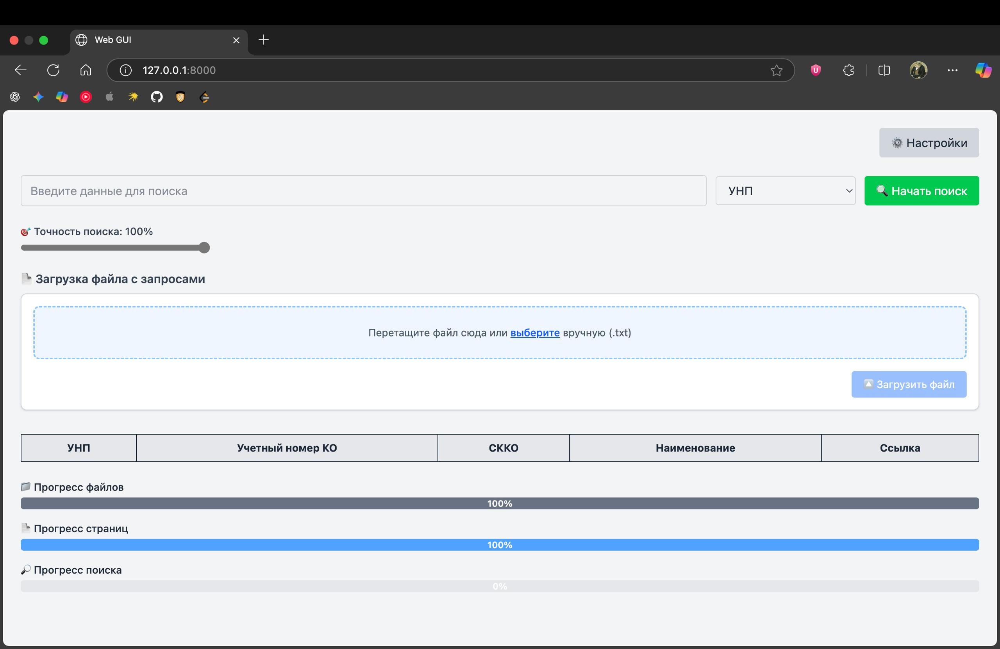
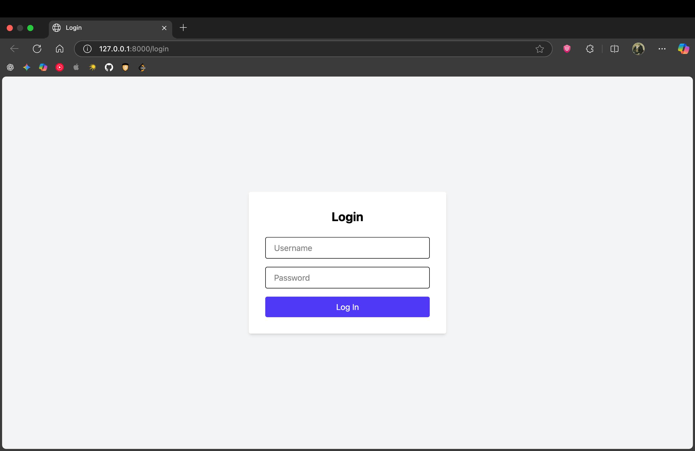

# Intelligent Document Search System

A full-stack web application for digitizing, indexing, and searching through scanned PDF documents. It solves the problem of finding specific data in low-quality scans where standard `Ctrl+F` fails.

The system uses **OCR (Tesseract)** for text extraction and **Fuzzy Search** to handle typos and recognition errors.

---

## 📸 Overview

### Search Dashboard
Main interface allows searching by specific fields (UNP, KO, Name). The **Accuracy Slider** lets users adjust fuzzy matching strictness (e.g., finding "12345" even if OCR read it as "I2345").


### Authentication
Simple session-based login system (credentials managed via environment variables).


---

## 🛠 Tech Stack & Key Features

*   **Backend:** Flask (Python 3.10+)
*   **OCR Engine:** Tesseract 5 + OpenCV (preprocessing: contrast/gamma correction for better recognition).
*   **Performance:** Uses Python's `multiprocessing` to handle heavy OCR indexing tasks in the background without freezing the UI.
*   **Search Logic:** Custom fuzzy search implementation using `rapidfuzz`.
*   **Frontend:** HTML5, TailwindCSS, Vanilla JS (long-polling for progress bars).
*   **Storage:** JSON-based indexing structure.

## ⚠️ Disclaimer / Project Status

This repository is a portfolio version of a real-world project.
*   **Redacted Data:** The `Indexed/` database and source `AKTY/` folders containing confidential PDFs have been removed.
*   **Security:** Production keys and specific business logic have been replaced with generic implementations to comply with privacy requirements.

---

## 🚀 How to Run

### Prerequisites
You need **Tesseract-OCR** installed on your system.
*   *MacOS:* `brew install tesseract`
*   *Ubuntu:* `sudo apt install tesseract-ocr`
*   *Windows:* Download and add Tesseract to your PATH.

### Installation

1.  **Clone the repo:**
    ```bash
    git clone https://github.com/Ivan-Gerasimovich/Intelligent-Document-Search.git
    cd Intelligent-Document-Search
    ```

2.  **Install Python dependencies:**
    ```bash
    pip install -r requirements.txt
    ```

3.  **Setup Environment:**
    Rename `.env.example` to `.env` and configure your admin credentials:
    ```bash
    mv .env.example .env
    ```

4.  **Run the application:**
    ```bash
    python WebGUI.py
    ```
    Access the interface at `http://127.0.0.1:8000`.
